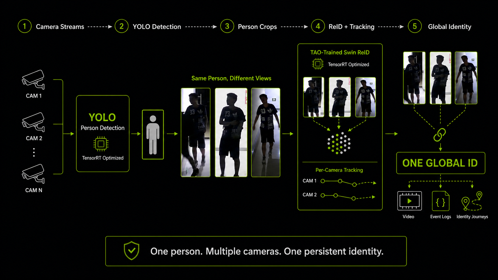

# Distributed Multi-Camera Person Re-Identification

[](https://www.python.org/)
[](docs/JETSON_DEPLOYMENT.md)
[](configs/yolo_config.yaml)
[](configs/reid_config.yaml)
[](src/onnx_reid_client.py)
[](https://github.com/sh4gen/Synthetic-Data-Enhanced-Multi-Camera-Intruder-Detection-Using-Edge-AI)

A realtime person ReID runtime for distributed camera networks. Camera workers
run person detection close to each video source; a prime node batches person
crops, extracts appearance embeddings, tracks each camera independently, and
assigns one global ID across the camera network.

The repository also includes synchronized multi-camera replay, transition
auditing, identity crop-video export, dataset evaluation, model import tools,
and fail-fast Jetson deployment checks.



> **Architecture figure:** this is a conceptual view of the complete pipeline.
> The checked-in realtime default runs `yolo26m.pt` through Ultralytics CUDA and
> the generalized Swin model through direct ONNX Runtime CUDA. TensorRT is an
> optional backend, not a requirement for the active deployment.

## Contents

- [Repository Scope](#repository-scope)
- [Implemented Architecture](#implemented-architecture)
- [How Global ReID Works](#how-global-reid-works)
- [Models And Backends](#models-and-backends)
- [Configuration](#configuration)
- [Workstation Quick Start](#workstation-quick-start)
- [Multi-Jetson Deployment](#multi-jetson-deployment)
- [Dashboard And Operations](#dashboard-and-operations)
- [Camera Topology](#camera-topology)
- [Recording](#recording)
- [Offline Multi-Camera Evaluation](#offline-multi-camera-evaluation)
- [Single-Video Pipeline](#single-video-pipeline)
- [Testing And Validation](#testing-and-validation)
- [Project Layout](#project-layout)
- [Operational Limits](#operational-limits)
- [Training Experiments And Citation](#training-experiments-and-citation)

## Repository Scope

This repository is the maintained **inference, orchestration, evaluation, and
Jetson deployment runtime**. It does not contain training datasets or model
weights.

The generalized Swin checkpoint consumed here was trained and evaluated in the
companion research repository:

[Synthetic Data Enhanced Multi-Camera Intruder Detection Using Edge AI](https://github.com/sh4gen/Synthetic-Data-Enhanced-Multi-Camera-Intruder-Detection-Using-Edge-AI)

The two repositories have separate responsibilities:

| Repository | Responsibility |
| --- | --- |
| This repository | Realtime workers, prime server, ReID inference, tracking, global identity logic, dashboard, recording, replay, and deployment |
| Companion experiment repository | Synthetic-data preparation, TAO Swin training, checkpoint evaluation, reports, and research results |

Large checkpoints, videos, recordings, crops, and experiment outputs are
ignored by Git. They must be staged separately on each machine.

## Implemented Architecture

```text
Camera worker, one process per camera

camera / RTSP stream
        |
        v
OpenCV capture
        |
        v
YOLO26m person detection on CUDA
        |
        +-- full-frame JPEG
        +-- [x1, y1, x2, y2, confidence, class]
        `-- one JPEG crop per detection
                         |
                         v
              binary WebSocket packet
                         |
                         v
Prime node

bounded ingest queue -> short arrival-time microbatch
        |
        v
decode crops -> generalized Swin ReID on ONNX Runtime CUDA
        |
        v
one BoTSORT instance per camera
        |
        v
quality gates + temporal confirmation + global identity gallery
        |
        +-- annotated dashboard frames
        +-- realtime metrics and worker controls
        +-- segmented processed recordings
        `-- optional ReID debug events and identity journeys
```

### Worker Responsibilities

Each [`RealtimeWorker`](src/realtime/worker.py):

1. Opens one USB, numeric OpenCV, file, or RTSP source.
2. Runs person-only YOLO inference.
3. JPEG-encodes the original frame and every detected person crop.
4. Packs detections and image payloads into the validated `RTP1` binary
   protocol.
5. Sends frames to the prime over `/ws/ingest`.
6. Reopens the source and reconnects after capture or network failure.

Workers do not run global ReID and do not decide global IDs.

### Prime Responsibilities

The [`RealtimePrimeServer`](src/realtime/prime_server.py):

1. Accepts one active WebSocket owner per globally unique `camera_id`.
2. Uses a bounded queue; when overloaded, the oldest queued packet is dropped
   instead of allowing unbounded latency.
3. Collects a short cross-camera microbatch and performs one bounded ReID call.
4. Processes packets in capture-event-time order within each microbatch.
5. Maintains an independent BoTSORT tracker for each camera.
6. Maps camera-local tracks to global IDs with the shared identity assigner.
7. Annotates frames, updates metrics, broadcasts to viewers, and records
   segmented MP4 files.

Slow dashboard clients have a send timeout and are disconnected instead of
blocking inference or recording.

## How Global ReID Works

The pipeline deliberately separates **local tracking** from **global identity**.

- A **local track ID** is created by one camera's BoTSORT instance. It handles
  short-term motion, occlusion, and local association. It is internal and is not
  shown to viewers.
- A **global ID** is assigned by the prime gallery. The dashboard and processed
  videos show it as `ID:<number>`.

Global IDs are session-scoped labels, not names or permanent biometric
identities. Numbering starts at `1` after a prime restart or gallery reset.

### Assignment Stages

1. **Detection quality gate**

   Low-confidence, very small, low-area, and weak frame-edge observations do
   not create or mutate an identity. A boundary-cut crop may hold an existing
   ID but cannot seed a new one.

2. **Temporal confirmation**

   A new local track remains pending until it has enough observations and
   elapsed time. The pending embedding is the normalized average of those
   observations, reducing dependence on one backlit or partial crop.

3. **Gallery matching**

   Embeddings are L2-normalized and compared with cosine distance. Lower
   distance means a closer appearance match. A candidate must satisfy the
   configured distance gate and, when multiple candidates exist, the required
   margin over the second-best candidate.

4. **Conflict constraints**

   Established visible IDs are reserved before new tracks are considered.
   Sustained spatially separate tracks in the same camera become a persistent
   cannot-link pair, preventing two proven-different people from later merging.
   Duplicate near-identical local boxes are suppressed.

5. **Camera topology**

   A global ID cannot appear concurrently in ordinary non-overlapping cameras.
   Declared overlap pairs may share an ID simultaneously after confirmation.
   Declared adjacent pairs allow a fast sequential handoff but never
   simultaneous presence.

6. **Bounded identity memory**

   The gallery stores bounded per-camera-track prototypes rather than only one
   continuously overwritten vector. This preserves earlier viewpoints while
   bounding memory. Entries expire after the configured TTL.

7. **Conservative remapping**

   Existing local tracks keep continuity through temporary appearance drift.
   A remap requires a clearly better candidate and sufficient margin; an
   edge-partial crop is not allowed to authorize the switch.

The core policy is implemented in
[`identity_assignment.py`](src/realtime/identity_assignment.py), with gallery
state in [`identity_gallery.py`](src/realtime/identity_gallery.py) and physical
camera relations in
[`camera_topology.py`](src/realtime/camera_topology.py).

## Models And Backends

| Stage | Active default | Runtime contract |
| --- | --- | --- |
| Person detector | `yolo26m.pt` | CUDA, FP16, 640 input, COCO person class `0`, confidence `0.50`, IoU `0.70` |
| ReID | `generalized_reid_swin_epoch119.onnx` | Input `input`: dynamic batch x 3 x 256 x 128; output `fc_pred`: batch x 1024 |
| Local tracker | BoxMOT BoTSORT | One tracker per camera, external ReID embeddings, 30-frame lost-track buffer |
| Global matching | In-process identity gallery | Cosine distance, temporal confirmation, topology and cannot-link constraints |

The ReID preprocessing must match training:

```text
BGR crop -> resize 256x128 -> RGB -> float32 / 255
         -> normalize with mean=[0.5, 0.5, 0.5]
                           std =[0.5, 0.5, 0.5]
         -> CHW tensor
```

Supported ReID backends:

| `REID_BACKEND` | Status |
| --- | --- |
| `onnxruntime_direct` | Active default; in-process ONNX Runtime CUDA |
| `tensorrt_direct` | Optional in-process TensorRT engine |
| `triton` | Optional legacy/offline server path |

Deployment model sizes and SHA-256 values are pinned in
[`deploy/model_manifest.yaml`](deploy/model_manifest.yaml). Jetson preflight
rejects missing, partial, or different deployment checkpoints.

Ultralytics may download a known detector checkpoint on first workstation use,
but unattended Jetson deployment must stage the exact detector file in advance.
The ReID checkpoint is never installed by `pip`.

## Configuration

Checked-in YAML files provide versioned defaults. Device-specific values belong
in one private repository-local `.env`, created from
[`.env.example`](.env.example).

```bash
# Prime node
scripts/reidctl.sh init prime

# Camera-only worker node
scripts/reidctl.sh init worker
```

The generated `.env` is ignored by Git and created with mode `0600`. Keep RTSP
credentials and private network addresses only in this file.

### Minimum Prime Configuration

```dotenv
PIPELINE_ROLE=prime
LOCAL_CAMERA_ENABLED=true

PRIME_URL=ws://192.0.2.10:8765
CAMERA_IDS=cam1

YOLO_MODEL_PATH=~/TwinProject_models/reid_generalized_yolo11n/yolo26m.pt
REID_MODEL_PATH=~/TwinProject_models/reid_generalized_yolo11n/generalized_reid_swin_epoch119.onnx

WORKER_NODES=prime=http://127.0.0.1:8787,worker=http://192.0.2.11:8787
REALTIME_OUTPUT_DIR=outputs/realtime
```

### Minimum Worker Configuration

```dotenv
PIPELINE_ROLE=worker
PRIME_URL=ws://192.0.2.10:8765
CAMERA_IDS=cam2
YOLO_MODEL_PATH=~/TwinProject_models/reid_generalized_yolo11n/yolo26m.pt
```

`192.0.2.x` addresses are documentation placeholders. Replace them with the
actual trusted-LAN addresses.

### Camera Mapping

For automatic USB discovery, leave `CAMERA_SOURCES` empty and provide exactly
one global ID for every camera expected on that device:

```dotenv
CAMERA_AUTO_SCAN=true
CAMERA_IDS=cam2,cam3,cam4
```

For fixed device paths or RTSP sources:

```dotenv
CAMERA_AUTO_SCAN=false
CAMERA_IDS=cam2,cam3
CAMERA_SOURCES="/dev/v4l/by-path/source-a,/dev/v4l/by-path/source-b"
```

Source count and camera-ID count must match. This strict mapping prevents a
reconnected camera from silently acquiring an ID already used by another
device.

The full operator-facing variable list is documented inline in
[`.env.example`](.env.example). The Python loader performs explicit boolean,
integer, float, list, camera-source, and topology-pair parsing and fails early
on invalid values.

## Workstation Quick Start

This path is for x86_64 development and offline evaluation. Jetsons require the
role-specific process in the next section.

```bash
git clone https://github.com/ikaganacar1/Reid_Inference_Pipeline.git
cd Reid_Inference_Pipeline

conda create -n reid-runtime python=3.10 -y
conda activate reid-runtime
python -m pip install -r requirements.txt
```

Stage the detector and ReID model, then initialize `.env`:

```bash
scripts/reidctl.sh init prime
# Edit .env and set model paths, camera IDs, and network/output settings.

scripts/reidctl.sh smoke --load-models
scripts/reidctl.sh start
scripts/reidctl.sh status
```

Open:

```text
http://<prime-ip>:8765/
```

The smoke test validates typed configuration, selected YAML files, protocol
serialization, a localhost WebSocket round trip, gallery behavior, and, with
`--load-models`, real detector/ReID/tracker initialization.

## Multi-Jetson Deployment

The active reference layout is one prime Orin plus one or more camera workers.
A prime may also host a local camera worker:

```text
prime Orin:
  prime server + ONNX ReID + per-camera trackers + global IDs
  dashboard + recording
  optional local YOLO camera worker

worker Orin:
  one YOLO worker process per connected camera
  worker control API
```

### Platform Boundary

The repository installer does **not** install or upgrade JetPack, CUDA, cuDNN,
TensorRT, GPU drivers, Jetson PyTorch, torchvision, or the NVIDIA camera stack.
Those packages must already be compatible and working as one JetPack unit.

The active ONNX path does not require Triton or a ReID TensorRT engine.

### Install Runtime

Prime:

```bash
ORT_WHEEL=/absolute/path/to/jetpack-matched-onnxruntime-gpu.whl \
  scripts/install_jetson_runtime.sh prime
```

Worker:

```bash
scripts/install_jetson_runtime.sh worker
```

The installer creates `.venv-jetson` with `--system-site-packages` so JetPack's
CUDA-enabled PyTorch and OpenCV remain authoritative. Ultralytics and BoxMOT
are installed without dependency resolution to prevent generic wheels from
replacing the JetPack builds.

### Validate And Start

Run on every device after editing its `.env`:

```bash
scripts/reidctl.sh smoke --load-models
scripts/reidctl.sh preflight
scripts/reidctl.sh start
```

Start the prime before remote workers. For boot-time operation:

```bash
# Prime device
scripts/install_jetson_services.sh prime --enable

# Worker device
scripts/install_jetson_services.sh worker --enable

# Once per device, if services must run before interactive login
sudo loginctl enable-linger "$USER"
```

The complete installation, model staging, integrity verification, GPU checks,
camera checks, and systemd workflow is in
[`docs/JETSON_DEPLOYMENT.md`](docs/JETSON_DEPLOYMENT.md).

## Dashboard And Operations

Common commands are identical on both roles:

```bash
scripts/reidctl.sh status
scripts/reidctl.sh logs
scripts/reidctl.sh restart
scripts/reidctl.sh stop
```

| Endpoint | Purpose |
| --- | --- |
| `http://<prime>:8765/` | Dynamic live dashboard |
| `http://<prime>:8765/status` | Prime, camera, queue, gallery, viewer, and recording metrics |
| `ws://<prime>:8765/ws/ingest` | Worker frame ingest |
| `ws://<prime>:8765/ws/view` | Annotated viewer stream |
| `http://<worker>:8787/status` | Camera discovery, worker processes, logs, and sent FPS |
| `http://<worker>:8787/control` | Start, stop, restart, scan, and scan/restart actions |

The dashboard:

- removes offline camera cards automatically;
- fills the available area dynamically, using a 2x2 grid for three or four
  cameras;
- reports camera FPS, detections, tracks, ReID time, tracking time, total
  processing time, queue use, packet drops, viewer count, gallery size, and
  recording state;
- proxies start, stop, and scan/restart actions to configured worker nodes;
- can reset the in-memory identity gallery or stop the prime.

USB discovery prefers stable `/dev/v4l/by-path/*video-index0` names. The worker
control loop rescans and restarts workers after unplug/replug or a USB-port
change. A dashboard stop action disables automatic restart until an explicit
start or restart.

## Camera Topology

Physical topology is part of the ReID algorithm, not only deployment metadata.
Configure it in `.env`:

```dotenv
# One person may be visible in both cameras at the same time.
OVERLAPPING_CAMERA_PAIRS=cam1:cam2,cam3:cam4

# Fast sequential route; simultaneous presence remains impossible.
ADJACENT_CAMERA_PAIRS=cam2:cam3

# Ordinary disjoint-camera exclusion window.
CROSS_CAMERA_EXCLUSION_SECONDS=1.0
ALLOW_ALL_CAMERA_OVERLAP=false
```

Use an overlap pair only when the physical fields of view genuinely overlap.
Do not enable `ALLOW_ALL_CAMERA_OVERLAP` as a general fix for missed matches;
it removes useful impossibility constraints and increases identity mixing when
people wear similar clothing.

See [`docs/REALTIME_PIPELINE.md`](docs/REALTIME_PIPELINE.md) for the detailed
identity policy, camera recovery behavior, transport, dashboard, and recording
design.

## Recording

The prime writes processed footage into a new session directory:

```text
outputs/realtime/recordings/<YYYYMMDD_HHMMSS>/
  cam1_000001_processed.mp4
  cam1_000002_processed.mp4
  cam2_000001_processed.mp4
```

Default behavior:

- OpenCV `mp4v` writer at `OUTPUT_FPS=10`;
- one file per camera;
- a new segment every 900 seconds;
- recording pauses below the configured free-space reserve while inference and
  live viewing continue;
- recording resumes into a new segment after space is restored;
- an optional required mountpoint prevents fallback writes to the root disk.

Automatic deletion is intentionally not implemented. Production sites must
define their own archive and retention policy.

## Offline Multi-Camera Evaluation

Use synchronized replay to test the same detector, ReID backend, BoTSORT
wrapper, and global identity assigner on recordings captured at the same time:

```bash
RECORDINGS_ROOT=/path/to/recordings \
SESSION=my_session \
FILE_NAME=recording.mkv \
REPLAY_FPS=25 \
STRIDE=1 \
OUTPUT_DIR=experiments/reid_audit \
scripts/start_reid_debug.sh
```

Replay advances by wall-clock time across cameras. It does not process one
complete camera video and then the next unless `--sequential` is explicitly
requested.

Useful topology overrides:

```bash
OVERLAPPING_CAMERA_PAIRS=ch201:ch301,ch401:ch501 \
ADJACENT_CAMERA_PAIRS=ch501:ch601 \
scripts/start_reid_debug.sh
```

The run can produce:

```text
experiments/reid_audit/
  annotated_videos/           # Global ID plus ReID distance/confidence
  offline_tracks.jsonl        # Per-frame tracks and assignment decisions
  reid_debug/events.jsonl     # Detailed ReID decisions
  summary.json                # Counts and embedding diagnostics
  cross_camera_analysis.json  # Journeys, conflicts, remaps, and near misses
```

Export one chronological crop video per global identity:

```bash
python scripts/export_identity_videos.py \
  experiments/reid_audit/offline_tracks.jsonl \
  --recordings-root /path/to/recordings \
  --session my_session \
  --output-dir experiments/reid_audit/identity_videos \
  --apply-edge-remap-guard
```

Create transition-aware contact sheets after the identity-video manifest has
been generated:

```bash
python scripts/create_transition_contact_sheets.py \
  experiments/reid_audit/reid_debug/events.jsonl \
  --identity-manifest experiments/reid_audit/identity_videos/manifest.json \
  --output-dir experiments/reid_audit/contact_sheets
```

These artifacts expose short identity splits and merges that can be missed
when reviewing only sparsely sampled annotated videos.

## Single-Video Pipeline

For one video and one local tracker:

```bash
python main.py \
  --video /path/to/input.mp4 \
  --experiment-name single_camera_test \
  --max-frames 1000
```

This runner uses the YAML files in `configs/`, writes an annotated video unless
`--no-visualization` is used, and records detections, embeddings metadata,
tracks, metrics, model hashes, system information, and a configuration
snapshot.

It does not exercise the distributed WebSocket path or the cross-camera global
gallery. Use synchronized replay for multi-camera ReID evaluation.

## Testing And Validation

Run the unit and integration-style test suite:

```bash
pytest -q
```

Covered behavior includes:

- ReID preprocessing and detector duplicate suppression;
- external-embedding BoTSORT integration;
- binary packet validation and JPEG round trips;
- bounded cross-camera gallery state;
- temporal identity confirmation and quality gates;
- overlap, adjacency, cross-camera exclusion, and cannot-link logic;
- camera restart and worker source mapping;
- microbatch event ordering, viewer timeouts, and recording rotation;
- disk-pressure and mount-loss handling;
- synchronized mixed-FPS replay, journey analysis, and identity exports;
- `.env` parsing, typed overrides, smoke checks, and Jetson preflight.

Deployment validation is intentionally layered:

```bash
# Hardware-independent application checks
scripts/reidctl.sh smoke --load-models

# Jetson platform, GPU, model hash, storage, clock, and camera checks
scripts/reidctl.sh preflight
```

## Project Layout

```text
.
|-- .env.example                 # Operator-facing runtime template
|-- configs/                     # Versioned YAML defaults
|-- deploy/
|   |-- model_manifest.yaml      # Deployment model sizes and SHA-256 hashes
|   `-- systemd/                 # Prime and camera service templates
|-- docs/
|   |-- assets/                  # README and architecture figures
|   |-- JETSON_DEPLOYMENT.md     # Jetson installation and boot services
|   `-- REALTIME_PIPELINE.md     # Detailed realtime behavior
|-- scripts/
|   |-- reidctl.sh               # Unified init/smoke/start/stop/status command
|   |-- smoke_test.py            # Runtime data-path smoke test
|   |-- jetson_preflight.py      # Hardware and deployment checks
|   |-- realtime_prime.py        # Prime entrypoint
|   |-- realtime_worker.py       # Camera worker entrypoint
|   |-- realtime_worker_control.py
|   |-- debug_reid_recordings.py # Synchronized multi-camera replay
|   |-- analyze_cross_camera_reid.py
|   |-- export_identity_videos.py
|   `-- create_transition_contact_sheets.py
|-- src/
|   |-- detector.py              # Ultralytics or direct TensorRT YOLO
|   |-- onnx_reid_client.py      # Active direct ONNX Runtime ReID backend
|   |-- tensorrt_reid_client.py  # Optional direct TensorRT ReID backend
|   |-- tracker.py               # External-embedding BoTSORT wrapper
|   |-- runtime_config.py        # Shared typed .env/YAML configuration
|   `-- realtime/
|       |-- protocol.py
|       |-- worker.py
|       |-- worker_control.py
|       |-- prime_server.py
|       |-- identity_gallery.py
|       |-- identity_assignment.py
|       `-- camera_topology.py
|-- tests/                       # Runtime and algorithm regression tests
|-- triton_models/               # Optional legacy Triton repository metadata
`-- main.py                      # Single-video pipeline entrypoint
```

Generated `experiments/`, `outputs/`, models, videos, crops, and logs are
ignored by Git.

## Operational Limits

- **Trusted LAN only:** ports `8765` and `8787` currently have no
  authentication or TLS termination. Do not expose them directly to the public
  internet.
- **Volatile identity state:** the global gallery is in memory. IDs do not
  persist across a prime restart or manual gallery reset.
- **Appearance is not identity proof:** uniforms, severe occlusion, lighting
  shifts, and low-resolution crops can still cause splits or merges. Calibrate
  thresholds with labeled journeys from the target camera network.
- **Clock synchronization matters:** workers should use NTP or PTP. Capture
  timestamps outside the configured skew bound fall back to prime receive time.
- **Topology must be measured:** overlap, adjacency, and minimum travel times
  are site-specific and cannot be inferred safely from model similarity alone.
- **No automatic recording retention:** low-space protection pauses recording
  but does not delete old footage.
- **No repository-wide license file:** do not assume reuse rights beyond those
  granted by dependencies, datasets, model providers, and project authors.
- **Privacy and legal review:** person ReID can be sensitive biometric
  processing. A deployment must follow applicable law, institutional policy,
  access control, retention rules, and human-oversight requirements.

## Training Experiments And Citation

Model training, synthetic-data filtering, target-specific and generalized Swin
experiments, checkpoint sweeps, and scientific reports are maintained in:

> [Synthetic Data Enhanced Multi-Camera Intruder Detection Using Edge AI](https://github.com/sh4gen/Synthetic-Data-Enhanced-Multi-Camera-Intruder-Detection-Using-Edge-AI)

That repository documents the TAO Toolkit 6.0.0 Swin Base experiments over
LTCC, DukeMTMC-reID, PRCC, and controlled synthetic augmentation. This runtime
consumes the exported generalized model produced by that work.

When using the model or experiment artifacts in research, cite the companion
repository:

```bibtex
@misc{acar2026syntheticreid,
  title  = {Synthetic Data Enhanced Multi-Camera Intruder Detection Using Edge AI},
  author = {Acar, Ismail Kagan and Berbergil, Askin Ali},
  year   = {2026},
  url    = {https://github.com/sh4gen/Synthetic-Data-Enhanced-Multi-Camera-Intruder-Detection-Using-Edge-AI}
}
```

The runtime integrates NVIDIA TAO-trained ReID models, ONNX Runtime, optional
TensorRT and Triton backends, Ultralytics YOLO, BoxMOT/BoTSORT, OpenCV, and
aiohttp.
